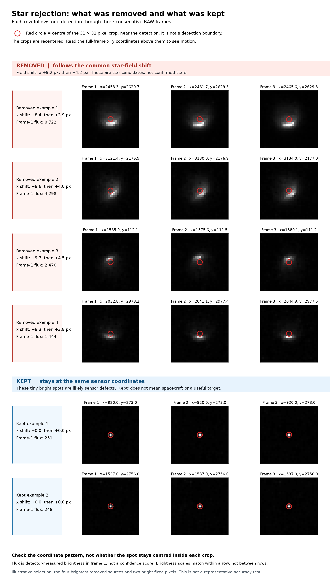

# SCRAP

SCRAP detects sources in SOBER optical RAW frames with Photutils. The
`star_rejection` scripts add step 4: remove detections that follow the common
star-field motion across consecutive frames.

## Run star rejection

Use the `*_detections.csv` files from `photutils_detect.py`. Keep the input
and output folders separate. The source CSVs stay unchanged.

```bash
python3 -m venv .venv
.venv/bin/pip install -r requirements.txt
.venv/bin/python star_rejection/star_reject.py \
  --input /path/to/detections \
  --output /path/to/filtered
```

The output folder contains one filtered CSV per input frame, with the same
filename and columns. It also contains `removed_star_candidates.csv`, which
lists removed rows, and `summary.json`, which gives counts and frame shifts.
Run `star_reject.py --help` for all options.

The default requires a consistent match across three frames. Set
`--min-frames 2` for a two-frame sequence, with less confidence. The script
supports only 2 or 3 frames as its evidence threshold, but processes longer
sequences with overlapping windows. `--match-radius` sets the maximum
adjacent-frame distance after alignment, in pixels. `--max-track-spread`
limits the separation among all aligned positions, including frames 1 and 3.
The defaults are 2 and 3 pixels, respectively.

The script matches coordinates, not detection IDs. It estimates the common
frame shift, searches nearby detections with a k-d tree, and keeps only
one-to-one nearest matches. It does not call every remaining detection a
spacecraft. Check candidates by hand before using them as labels.

## Start from RAW frames

If you do not already have detection CSVs, the wrapper runs the existing
detector over a local folder of `.raw` files. It writes CSVs without the
detector's large plots.

```bash
.venv/bin/python star_rejection/run_detections.py \
  --input /path/to/OPTICAL \
  --output /path/to/detections
```

The RAW files are not included here. The wrapper reads local files; it does
not stream from OneDrive. It skips completed CSVs on a rerun.

## Check the result

```bash
.venv/bin/python star_rejection/verify_outputs.py \
  --input /path/to/detections \
  --output /path/to/filtered
.venv/bin/python -m unittest discover -s star_rejection -p 'test_*.py'
```

The verifier checks that every retained row still has its original values.
Five unit tests cover matching, frame gaps, the evidence threshold, and
repeatability. The first three tested SOBER frames had 807 detections; the
script removed 273 and retained 534. This is a sample check, not a
full-dataset accuracy claim.



The sheet shows four bright removed candidates and two retained fixed pixels.
Each crop is recentered, so read the full-frame coordinates above it to see
motion. The red circle marks the crop centre, not a detection boundary.
This selection explains the output but is not a representative accuracy test.
To regenerate it from three RAW frames and their CSVs, run
`star_rejection/make_review_sheet.py --help`.
